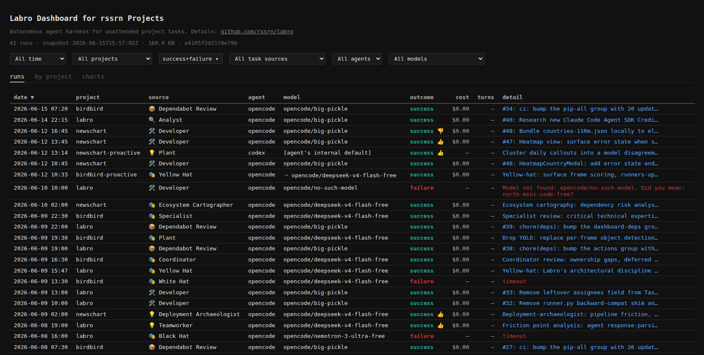
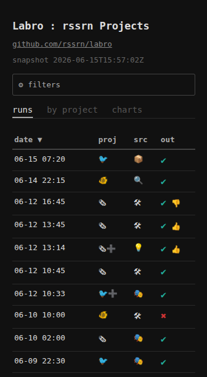
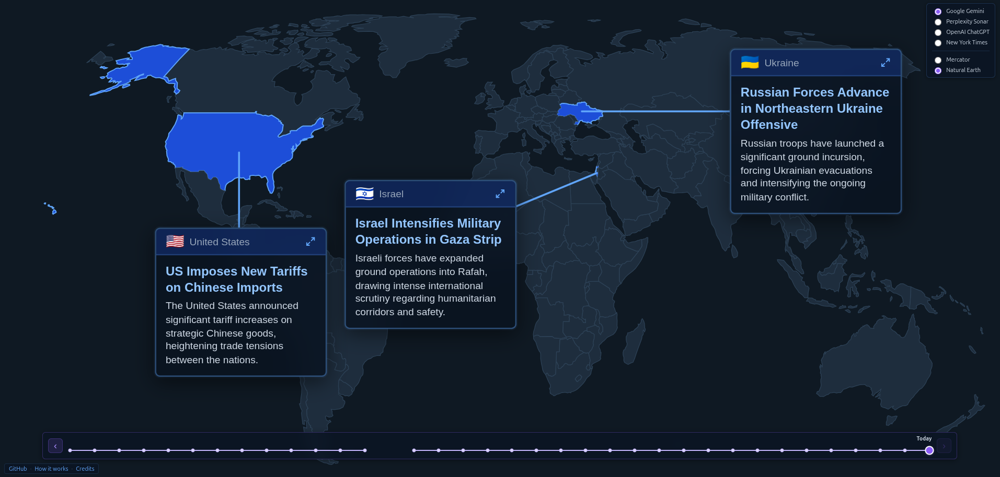
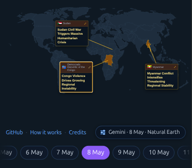
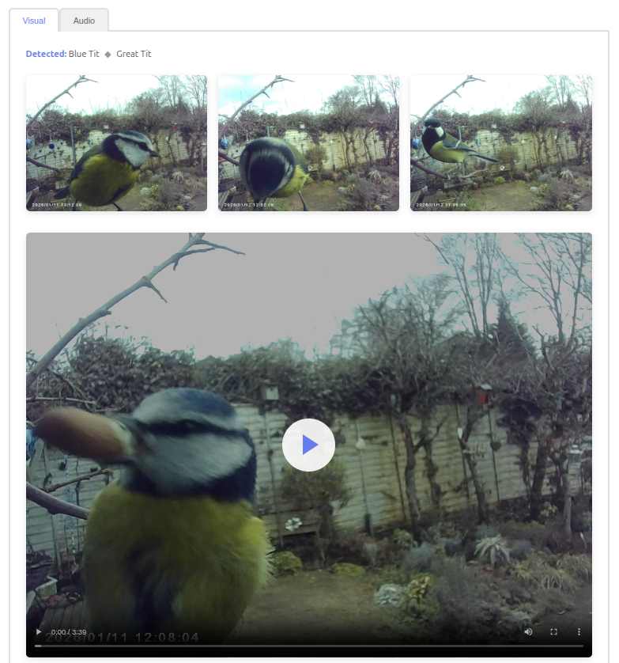
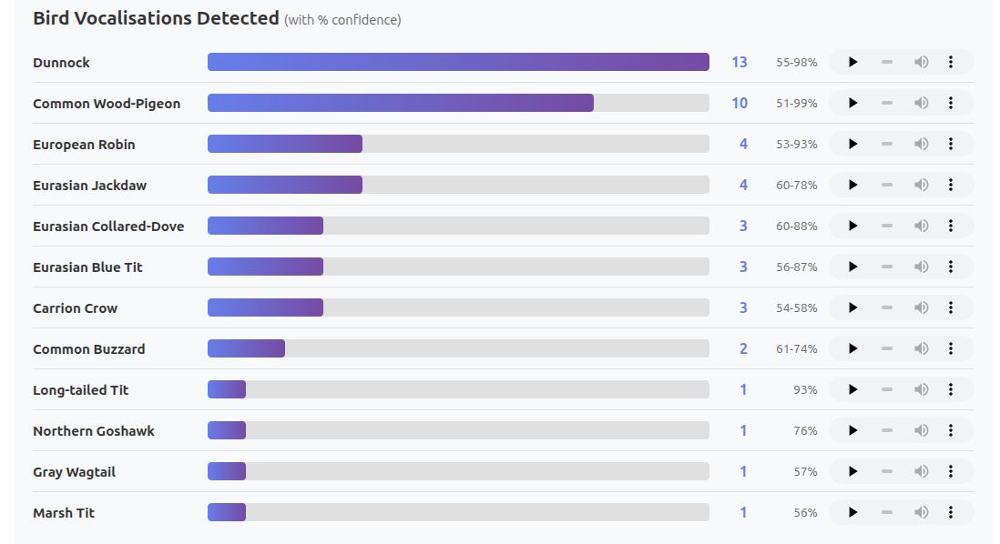
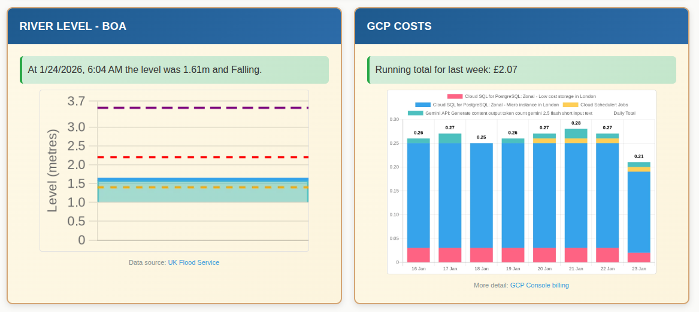

Samples of personal projects for [Ross Arnold](https://www.linkedin.com/in/rarnold/).  Does not include any paid/work projects.

  

    
  

  

    

      <h2>Labro</h2>
      

        <a class="read-more" href="./labro" aria-label="Read more about Labro">Read more</a>
        <a class="live-site" href="https://labro.rossarnold.uk/" aria-label="Live site for Labro">Live site</a>
      

    

    
Live · AI coding agent orchestrator

    
Runs AI coding agents on a schedule against GitHub Issues, then records the outcome directly on the issue. Configurable triggers, prompts, and permissions.

  

  

  

    
  

  

    

      <h2>NewsChart</h2>
      

        <a class="read-more" href="./newschart" aria-label="Read more about NewsChart">Read more</a>
        <a class="live-site" href="https://newschart.rossarnold.uk/" aria-label="Live site for NewsChart">Live site</a>
      

    

    
Live · AI news coverage mapped by model

    
Several leading AI models are asked daily for the top three international news stories, plotted on a world map so you can compare editorial judgement across models.

  

  

  

    
  

  

    

      <h2>birdbird</h2>
      

        <a class="read-more" href="./birdbird" aria-label="Read more about birdbird">Read more</a>
        <a class="live-site" href="https://birdbird.rossarnold.uk/" aria-label="Live site for birdbird">Live site</a>
      

    

    
Live · Bird cam with ML detection

    
Processes motion-captured clips from a bird feeder camera and presents the results on the web, including species detection from both audio and video.

  

  

  

    
  

  

    

      <h2>n8n workflows</h2>
      

        <a class="read-more" href="./n8n-workflows" aria-label="Read more about n8n workflows">Read more</a>
      

    

    
Internal · Workflow automation on GCP

    
Self-hosted n8n instance running scheduled data aggregation, reporting, and backup workflows on GCP infrastructure managed with Terraform.

  

  
  

